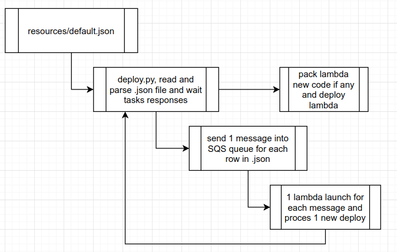
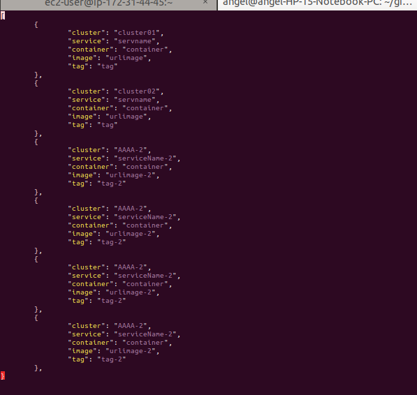

# Challenger!

Deploy a new image and tag into a specific amazon cluster and service in ECS

# Solution proposed

I developed an application in python that allows to deploy multiple images/tag in **parallel** depending on a cluster, a service **and a container name** (for the commonly used multi container task).

Tecnological stack used:

 - python3.7
 - shell script
 - AWS SQS
 - AWS ElastiCache(redis)
 - AWS Lambda
 - Boto3
 - Docker and docker-compose

As a plus

 - It has developed a satellite communication system between the AWS lambdas and the "[deploy.py](deploy.py)" program using AWA SQS and AWS ElastiCache
 - Lambda new code is packed and updated deploy at the same time
 - Lambda code and deploy program share same libraries

(Screen shot of interactive mode, show all lambda launched) 

The program ends where all lambdas launched ended and state is updated

*Note: Solution could be easy if you deploy with image:LATEST in this case you just need update the image and force-reload the service

## AWS resources and summary

## Basic Workflow

##  Directory Strcture

## How to Use

### Mantain resources/default.json

File--> "[resources/default.json](resources/default.json)"

Add in this file all you cluster/services/container/image/tag yo want to deploy

### Edit enviroment_vars file with you aws account details

File--> "[enviroment_vars](enviroment_vars)"

Replace xxxx with you aws details variable names are self-explanatorys...

### Run deploy

Main python program for deploy is loacted inside file "[project/app_deploy.py](project/app_deploy.py)"

The program do:

 1. Deploy again lambda source code with dependencies in this case shell script "[pack_lambda](pack_lambda)" is used
 2. Map SQS queue to new lambda function
 3. Send SQS message to queue with new deploy details (one message per item inside default.json)
 4. Wait to terminate until all lambdas launched end

    python deploy.py -h

    -i --> you can run with interactive mode
    --file_specs FILE --> you can specify another file, by default resources/default.json

#### Mode 1 run with docker
*Requirement docker and docker-comapose installed

    sudo docker-compose up --build deploy

#### Mode 2 run with interactive mode
*Requirement: python3.7 and virtualenv installed

    `./run_interactive

*With interactive mode you can see how all lambdas run un parallel mode

## AWS Lambda

Main code for lambda code is located inside "[project/app_lambda01.py](project/app_lambda01.py)"

Please note that this project could be extended to deploy multiple lambdas with the same project and share the same code and libraris in one single project.

*Attention certainly this code may NOT work for a certain type of task need to be improved...

**As amazon recomend is better to use the tag "latest" and you just need update the new image into repository(and force reload the service)

*** You can check the comunication between deploy.py and all lambdas with redis

## Future improvements

 1. Create a new SQS queue from scratch and remove when program finish at this moment we conect to existing sqs queue
 2. Similar as point 1 create a Redis instance and remove at the end.
 3. Work for multiple Zones and VPC
 4. Deploy mupltiple lambdas at once
 5. Test development before deploy
....
